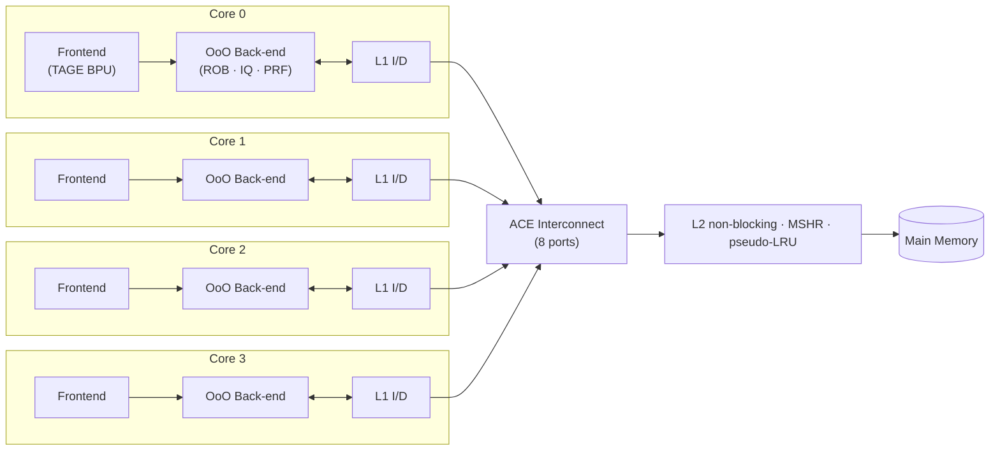
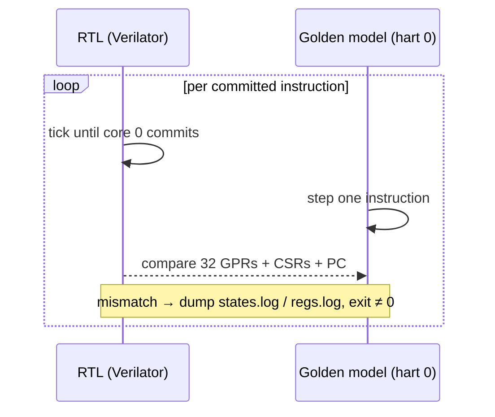

<div align="center">


# Chiron

### A quad-core RV64IMA out-of-order processor, in Chisel

*In ancient lore **Chiron** (Kai-ron) was the wisest of the Centaurs — not a wild brute,*
*but a gentle healer and the supreme teacher of heroes: Achilles, Heracles, Jason.*
*He walks on four limbs (a **quad-core** lineage) yet his legacy is to **educate**.*
*This core is built in that spirit — a teaching-grade, fully verified OoO machine.*

<br/>


</div>

---

## Highlights

- **Quad-core** RV64IMA — 4 independent OoO harts sharing a **non-blocking L2**
  and an **ACE coherent interconnect** (8 ports, 2 per core).
- **Out-of-order** pipeline per core — register renaming, a reorder buffer, a
  centralized issue queue with wake-up, and in-order commit.
- **Full memory hierarchy** — split L1 I/D caches, non-blocking L2 with MSHRs
  and pseudo-LRU, ACE-style coherent interconnect.
- **Modern branch prediction** — bimodal + BTB (64 sets, 2-way LRU) + a
  **4-table TAGE** predictor.
- **Cycle-accurate, lock-step verified** against a C++ golden-model emulator,
  one committed instruction at a time — **83/84 official `riscv-tests` pass**.
- **One command per task.** No copying files around: every harness loads images
  by path, driven from a single benchmark manifest.
- **164 hardware performance counters** exposed from the RTL (41 per core × 4)
  — IPC, branch accuracy, cache miss rates, ROB-head stall decomposition,
  per-class latency attribution.

---

## See it run

```bash
make fire            # bare-metal Doom-fire demo, UART → terminal
```

<div align="center">

</div>

---

## Microarchitecture



### Per-core parameters

| Property | Value |
|---|---|
| ISA | RV64IMA (no F/D/V/C) |
| Reorder buffer | 16 entries |
| Physical registers | 64 (LVT-based rename) |
| Issue queue | 8 entries, centralized |
| Commit width | 4-wide |
| Divider | Radix-4 (2 bits/cycle), clz-normalized |
| L1 I-Cache | 2-way · 64 sets · 16-instr lines |
| L1 D-Cache | 2-way · 64 sets · 8×8-byte lines |
| Branch predictor | Bimodal + BTB + 4-table TAGE |
| Clock target | 75 MHz |

### System parameters

| Property | Value |
|---|---|
| Cores | 4 (hart IDs 0–3) |
| Coherence | ACE — 2 ports per core (8 total) |
| L2 Cache | Non-blocking · MSHR · pseudo-LRU |
| UART | MultiUart (one per core) |
| RAM base | `0x8000_0000` (sim) · `0x4000_0000` (Zynq) |

---

## Repository layout

```
chiron/
├── src/main/scala/        # Chisel RTL — grouped by pipeline function:
│   ├── Frontend/          #   fetch + branch prediction (TAGE/BTB)
│   ├── Decode/            #   decode + register rename
│   ├── Backend/           #   OoO execution: Rob · Prf · Scheduler · StoreDataIssue
│   ├── pipeline/          #   shared port/fifo bundles (pipeline.ports / .fifo)
│   ├── Icache/            #   L1 instruction cache (+ shared AXI bundle)
│   ├── Dcache/            #   L1 non-blocking data cache
│   ├── L2_cache/          #   shared non-blocking L2 (MSHR · pseudo-LRU)
│   ├── Interconnect/      #   ACE coherence unit (CCU)
│   ├── common/            #   configuration / parameters
│   ├── testbench/         #   system top, main memory model, UARTs
│   └── core.scala         #   per-core top-level (frontend → backend → L1)
├── sim/                   # all host-side C++ (golden model · RTL wrapper · drivers)
│   ├── emulator/          #   C++ golden-model ISA simulator (4-hart, lock-step ref)
│   │   ├── hart.h         #     one hart — split into hart_{csr,trap,alu,memory,execute}.inc
│   │   ├── emulator.h     #     4-hart container
│   │   └── terminal.h · clint.h · constants.h
│   ├── rtl/               #   Verilator RTL wrapper
│   │   ├── rtl_model.h    #     single-core (core 0) signal accessors + stepping
│   │   └── profiler.h · profiler_quad.h   # perf-counter read-out
│   ├── harness/           #   test/run drivers
│   │   ├── common/        #     shared helpers: args.h · image.h · completion.h
│   │   ├── lockstep.cpp   #     RTL-vs-emulator lock-step (core 0)
│   │   ├── lockstep_isa.cpp   # ISA regression completion
│   │   ├── lockstep_linux.cpp # Linux-boot variant
│   │   ├── profile.cpp    #     single-core cycle-accurate profiler
│   │   ├── profile_quad.cpp   # quad-core profiler (all 4 cores + aggregate IPC)
│   │   └── fire.cpp       #     bare-metal UART → terminal streamer
│   ├── tests/riscv-isa/   #   ISA regression images (images · avoid · dumps)
│   └── data/              #   runtime inputs: Image · qemu.dtb · boot.bin
├── workloads/
│   ├── benchmarks/        # benchmark sources (vvadd · matmul · filter · csaxpy · histo)
│   └── demos/             # bare-metal demos (fire 🔥)
├── bins/                  # staged .bin images
│   ├── mt-*-s1..s5.bin    #   single-core scaled variants
│   └── mt-*-q4.bin        #   quad-core (NUM_CORES=4) base variants
├── mk/                    # modular makefiles
│   ├── config.mk          #   paths, compiler flags, SHOW_STATE / DUMP_WAVES vars
│   ├── benchmarks.mk      #   benchmark manifest (done-PCs, families)
│   ├── rtl.mk             #   Chisel → Verilog → Verilator
│   ├── bins.mk            #   single-core .bin build + stage
│   ├── bins_quad.mk       #   quad-core .bin build + stage (NUM_CORES=4)
│   └── run.mk             #   all harness build + run targets
├── scripts/               # profiling visualisation, log decoders
├── build/                 # all generated artifacts (gitignored)
└── Makefile               # thin orchestrator — one entry point per task
```

---

## Quick start

### Prerequisites

```bash
sudo apt install verilator sbt make g++ python3
# RISC-V toolchain must be on PATH (riscv64-unknown-elf-gcc)
# If sbt hangs on file watches:
make fix-inotify
```

### Step 1 — Build the RTL

```bash
make sim        # Chisel → Verilog → Verilator library (~5 min first time)
```

> **Gotcha:** `make sim` always exits 0 even when `sbt` fails — it reuses a
> stale `system.v`. Always verify by spot-checking the generated file:
> ```bash
> grep "WLAST" system.v   # should have > 0 hits
> ```

---

## Running in single-core mode

Single-core runs use the pre-built `bins/mt-*-s<scale>.bin` images (compiled with
`NUM_CORES=1`). The benchmark name is `<family>-s<scale>` where scale 1 is smallest.

### Lock-step verification (correctness)

Compares RTL output against the golden emulator instruction-by-instruction:

```bash
make lockstep BENCH=vvadd-s1     # smallest, fastest (~30 s)
make lockstep BENCH=csaxpy-s2    # ~5 min
make lockstep BENCH=matmul-s2    # ~8 min
```

Logs are written to `build/run.log`, `build/states.log`, `build/regs.log`.

### Cycle-accurate profiling (IPC)

```bash
make profile BENCH=vvadd-s1      # → build/profile_results/vvadd-s1.json
make profile BENCH=csaxpy-s3
```

### Profile all single-core scales (s1–s5) for all benchmarks

```bash
make profile-all-sc              # → build/profile_results/<fam>-s<N>.json + chart
```

#### Single-core benchmark profile (s1 scale)

<div align="center">

</div>

| Benchmark | Cycles | IPC | Branch Acc | D$ Miss | DRAM RD BW |
|---|---|---|---|---|---|
| matmul-s1 | 501 899 (partial) | **0.290** | 10.4 % | 0.4 % | 0.70 MB/s |
| histo-s1 | 2 922 556 | **0.168** | 43.1 % | 0.9 % | 0.78 MB/s |
| filter-s1 | 116 208 | **0.153** | 49.9 % | 6.6 % | 3.88 MB/s |
| csaxpy-s1 | 925 833 | **0.117** | 59.4 % | 1.0 % | 0.45 MB/s |
| vvadd-s1 | 810 375 | **0.126** | 59.5 % | 1.6 % | 0.57 MB/s |

> matmul runs at ~0.29 IPC because its tight inner loop rarely stalls the ROB;
> vvadd and csaxpy sit near 0.12–0.13 because the coordinator hart stalls heavily
> on the ROB waiting for the compute harts (even in single-core mode the barrier
> logic dominates). The low branch accuracy reflects the bimodal predictor
> struggling with infrequent loop-exit branches.

---

## Running in quad-core mode

Quad-core runs use the `bins/mt-*-q4.bin` images (compiled with `NUM_CORES=4`).
All 4 harts execute cooperatively; the profiler reads all 164 performance counters.

### Quad-core profile for a single benchmark

```bash
make profile-quad FAM=vvadd      # → build/profile_results/vvadd-q4.json
make profile-quad FAM=csaxpy
make profile-quad FAM=matmul
make profile-quad FAM=filter
make profile-quad FAM=histo
```

### All quad-core benchmarks + chart

```bash
make profile-all                 # profiles every family, generates profile_report.png
```

### Quad-core pass/fail regression

```bash
make test-q4                     # profile-based pass/fail on vvadd-q4
```

---

## Profiling values — reference numbers

Results from the Verilator simulation at ~6 500 RTL cycles/sec. Quad-core
benchmarks are compiled with `DATA_SIZE` matching the `s1` scale unless noted.

### vvadd-q4 (vector-vector add, all 4 cores)

| Metric | Aggregate | Core 0 | Cores 1–3 |
|---|---|---|---|
| **IPC** | **1.085** | 0.119 | ~0.322 |
| Instructions retired | 862 770 | 94 966 | ~255 900 each |
| Max cycles | 795 033 | — | — |
| Branch accuracy | — | 61.6 % | 77.4 % |
| D-cache miss rate | — | 1.7 % | 5.7 % |
| ROB stall % | — | 64.4 % | ~2.1 % |
| Decode efficiency | — | 26.0 % | ~98 % |

> Core 0 acts as the coordinator (barrier + result check), hence its lower IPC
> and high ROB stall fraction. Cores 1–3 execute the compute kernel.

### histo-q4 (histogram, all 4 cores)

| Metric | Aggregate | Core 0 | Cores 1–3 |
|---|---|---|---|
| **IPC** | **1.017** | 0.171 | ~0.282 |
| Instructions retired | 3 716 508 | 624 914 | ~1 030 000 each |
| Max cycles | 3 653 789 | — | — |
| Branch accuracy | — | 39.1 % | ~74.0 % |
| D-cache miss rate | — | 1.2 % | ~2.1 % |
| ROB stall % | — | 45.9 % | ~5.3 % |

---

## Debugging features

### Print internal state each step (`SHOW_STATE`)

Prints the golden-model register file after every committed instruction — useful
for diagnosing mismatches or tracing program flow:

```bash
make lockstep BENCH=vvadd-s1 SHOW_STATE=1
```

Works on any `lockstep` variant. Writes to stdout alongside the existing log files.

### Capture waveforms (`DUMP_WAVES`)

Writes a VCD waveform to `build/system_trace.vcd` for viewing in GTKWave:

```bash
make lockstep BENCH=vvadd-s1 DUMP_WAVES=1
# Then open:
gtkwave build/system_trace.vcd
```

> **Performance note:** VCD generation enables Verilator signal instrumentation
> (`traceEverOn`), which substantially increases simulation overhead. Use only
> when you need waveforms; omit it for routine lock-step runs.

Both flags can be combined:

```bash
make lockstep BENCH=csaxpy-s2 SHOW_STATE=1 DUMP_WAVES=1
```

---

## Full regression

```bash
make test
```

Runs in two stages:

- **ISA suite** (`make isa`) — 84 official `riscv-tests` images, lock-step RTL
  vs golden model. Progress is printed per-test. Expected result: **83/84**
  (`rv64ui-p-fence_i` is a known I-cache coherence limitation).
- **Quad-core vvadd** (`make test-q4`) — profile-based pass/fail on
  `bins/mt-vvadd-q4.bin`.

---

## Verification — lock-step

Correctness is proven by running the **RTL** and the **C++ golden model** in
lock-step, comparing architectural state after **every committed instruction**:



Divergences dump `run.log`, `states.log`, `regs.log` to `build/` for debugging.

---

## Performance counters

The RTL exposes 41 counters per core (164 total). The profiler aggregates them
into:

| Metric | Source |
|---|---|
| IPC | `inst_retired / cycles` |
| Aggregate IPC (quad) | `Σ(inst_retired) / max(cycles)` |
| Branch accuracy | `branches_passed / branch_total` |
| D-cache miss rate | `dcache_miss / dcache_reqs` |
| I-cache miss rate | `icache_miss / decode_ready` |
| Scheduler stall % | `scheduler_stalls / decode_ready` |
| ROB stall % | `rob_stalls / decode_ready` |
| Decode efficiency | `decode_fired / decode_ready` |
| DRAM read BW | `l2_to_mem_rd_beats × 8 B × 75 MHz` |

JSON reports are written to `build/profile_results/`.

---

## Timing reference (Verilator, ~6 500 RTL cycles/sec)

| Benchmark | Approx wall time |
|---|---|
| vvadd-s1 (lock-step) | ~30 s |
| vvadd-q4 (profile) | ~2 min |
| csaxpy-s2 (lock-step) | ~5 min |
| csaxpy-s5 / csaxpy-q4 | ~25 min |
| matmul / filter / histo (q4) | 5–15 min |

---

## Make target reference

| Target | What it does |
|---|---|
| `make sim` | Build the RTL (Chisel → Verilog → Verilator) |
| `make bins` | Build + stage single-core `.bin` images |
| `make bins-q4` | Build + stage quad-core `.bin` images (`-DNUM_CORES=4`) |
| `make bins-all` | Both of the above |
| `make emu BENCH=…` | Run benchmark on the golden emulator (fast, no RTL) |
| `make lockstep BENCH=…` | Lock-step RTL vs emulator; writes logs to `build/` |
| `make lockstep … SHOW_STATE=1` | Same, plus per-step golden-model register dump |
| `make lockstep … DUMP_WAVES=1` | Same, plus VCD to `build/system_trace.vcd` |
| `make isa` | Full RISC-V ISA regression suite (83/84 expected) — progress per test |
| `make test` | ISA suite + quad-core vvadd pass/fail |
| `make profile BENCH=…` | Single-core cycle-accurate profile |
| `make profile-quad FAM=…` | Quad-core profile for one benchmark family |
| `make profile-all` | Quad-core profile for all benchmarks + chart |
| `make profile-all-sc` | Single-core profile for all benchmarks, all scales |
| `make fire [FIRE_FRAMES=N]` | Bare-metal Doom-fire demo |
| `make linux BENCH=…` | Linux-boot lock-step harness |
| `make clean` | Remove generated artifacts (`build/`, `obj_dir`, logs) |
| `make distclean` | `clean` + drop sbt/Verilator build trees |
| `make help` | List all targets with descriptions |

`BENCH` = `<family>-s<scale>`. `FAM` = `<family>` alone (no scale).  
Families: `vvadd matmul filter csaxpy histo`. Scales: `s1`–`s5`. Default `BENCH`: `vvadd-s1`.

> The benchmark manifest (`mk/benchmarks.mk`) is the single source of truth for
> done-PCs and family names. Adding a workload is a one-line edit — no harness
> copy-paste required.

---

## Roadmap

- Profile all 5 benchmarks at s1–s5 scales on the quad-core to establish a
  baseline IPC (currently ~0.125 — single-core IPC improvements not yet ported).
- Port the single-core IPC optimisations (radix-4 divider, store-data trim,
  load-queue flow-through) to the quad-core back-end.
- Add **SPLASH-3** multi-threaded benchmarks for academically comparable results.
- Target IPC approaching 1.0 per core (4× aggregate) through microarchitectural
  tuning of the OoO window, commit width, and cache hierarchy.

---

## Credits

Built as a final-year project at the **University of Moratuwa**.

**Contributors** (in alphabetical order):
* Ajith Pasquel
* Hiruna Vishwamith
* Kavieesha Yalegama
* Leon Fernando
* Mewan Rathnayaka
* Yasiru Amarasinghe

Chisel/FIRRTL by the Chisel community; verification leans on **Verilator** and
the official **riscv-tests**. The Chiron artwork crowns a core meant, above all,
to teach.

<div align="center">
<sub>"The wisest of the Centaurs taught heroes. This core teaches how an out-of-order machine really works."</sub>
</div>
