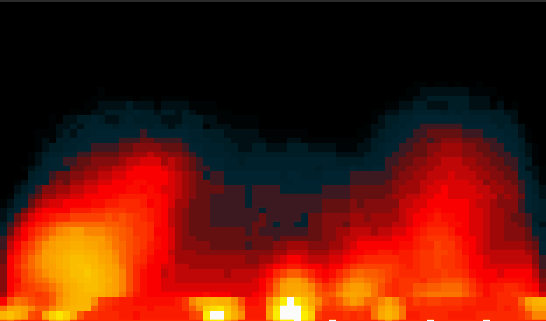
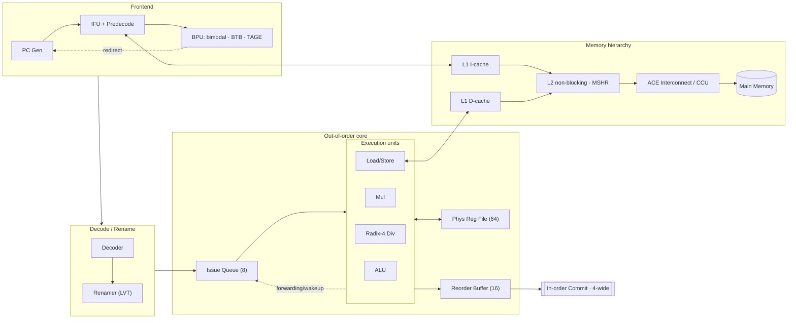
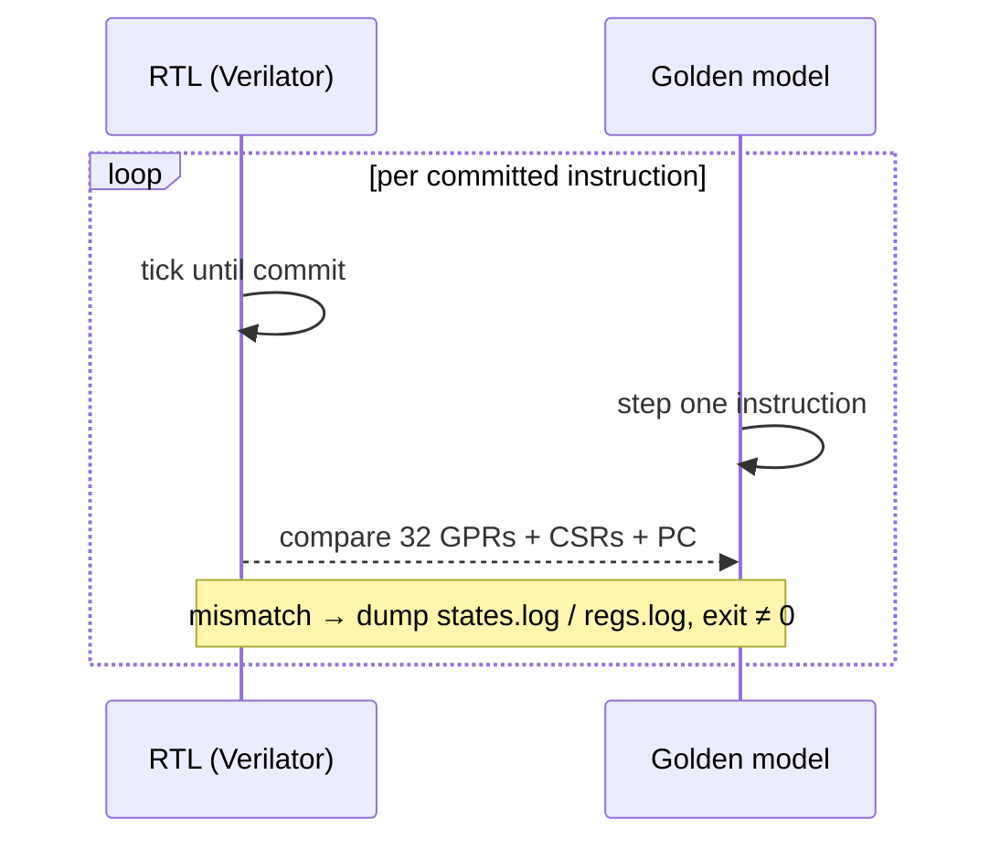

<div align="center">


# Chiron

### An RV64IMA out-of-order superscalar processor, in Chisel

*In ancient lore **Chiron** (Kai-ron) was the wisest of the Centaurs — not a wild brute,*
*but a gentle healer and the supreme teacher of heroes: Achilles, Heracles, Jason.*
*He walks on four limbs (a **quad-core** lineage) yet his legacy is to **educate**.*
*This core is built in that spirit — a teaching-grade, fully verified OoO machine.*

<br/>


-f0883e)


</div>

---

##  Highlights

- **Out-of-order** RV64IMA pipeline — register renaming, a reorder
  buffer, a centralized issue queue with wake-up, and in-order commit.
- **Full memory hierarchy** — split L1 I/D caches, a **non-blocking L2** with
  MSHRs and pseudo-LRU, and an **ACE-style coherent interconnect**.
- **Modern branch prediction** — bimodal + BTB (64 sets, 2-way LRU) + a
  **4-table TAGE** predictor.
- **Cycle-accurate, lock-step verified** against a C++ golden-model emulator,
  one committed instruction at a time — **84/84 official `riscv-tests` pass**.
- **One command per task.** No copying files around: every harness loads images
  by path, driven from a single benchmark manifest.
- **It boots Linux**, and runs bare-metal demos — including a real-time
  terminal **fire** 🔥 (below).

---

##  See it run

A bare-metal Doom-fire renders straight from the core's UART — 80×50 half-block
glyphs, scrolling embers rising from a hot bed, running on real RTL:

<div align="center">

</div>

```bash
make fire            # build + render live (Ctrl-C to stop)
```

---

##  Microarchitecture



| Property | Value |
|---|---|
| ISA | RV64IMA (no F/D/V/C) |
| Reorder buffer | 16 entries |
| Physical registers | 64 (LVT-based rename) |
| Issue queue | 8 entries, centralized |
| Commit width | 4-wide |
| Divider | Radix-4 (2 bits/cycle), clz-normalized |
| L1 I-Cache | 2-way · 64 sets · 16-instr lines |
| L1 D-Cache | 2-way · 64 sets · 8×8-byte lines |
| L2 Cache | Non-blocking · MSHR · pseudo-LRU |
| Branch predictor | Bimodal + BTB + 4-table TAGE (5/15/44/130-bit history) |
| Clock target | 75 MHz |
| RAM base | `0x8000_0000` (sim) · `0x4000_0000` (Zynq) |

---

##  Repository layout

```
Chiron/
├── src/main/scala/        # Chisel RTL (frontend, decode, scheduler, rob, prf, caches, …)
├── emulator/              # C++ golden-model ISA simulator (lock-step reference)
├── simulator/             # Verilator RTL wrapper (simulator.h)
├── harnesses/             # Test/run drivers
│   ├── lockstep.cpp       #   unified, arg-driven RTL-vs-emulator lock-step
│   ├── lockstep_isa.cpp   #   ISA regression completion logic
│   ├── lockstep_linux.cpp #   Linux-boot (dtb/bootrom) variant
│   ├── profile.cpp        #   cycle-accurate IPC / stall profiler
│   └── fire.cpp           #   bare-metal UART → terminal streamer
├── workloads/
│   ├── benchmarks/        # benchmark sources (vvadd, matmul, filter, csaxpy, histo)
│   └── demos/             # bare-metal demos (the fire 🔥)
├── bins/                  # built + staged .bin images (loaded by path)
├── mk/                    # modular makefiles (config · benchmarks · rtl · bins · run)
├── scripts/               # profiling visualization, log decoders
├── build/                 # all generated artifacts (gitignored)
└── Makefile               # thin orchestrator — one entry point per task
```

---

##  Quick start

### Prerequisites

```bash
sudo apt install verilator sbt make g++ python3
# If sbt hangs on file watches:
make fix-inotify
```

### Build & verify

```bash
make sim                       # Chisel → Verilog → Verilator library
make test                      # ISA suite (84) + every benchmark, lock-step
```

### Run one thing

```bash
make emu       BENCH=vvadd-s1  # golden emulator only (fast sanity check)
make lockstep  BENCH=matmul-s2 # RTL vs emulator, cycle-exact
make profile   BENCH=vvadd-s1  # IPC + stall decomposition
make fire                      # the bare-metal fire demo
```

`BENCH` is `<family>-s<scale>`; families are `vvadd matmul filter csaxpy histo`,
scales `s1`…`s5`. Defaults to `vvadd-s1`.

### Make target reference

| Target | What it does |
|---|---|
| `make sim` | Build the RTL (Chisel → Verilog → Verilator) |
| `make bins` | Build + stage every workload `.bin` into `bins/` |
| `make emu BENCH=…` | Run a benchmark on the golden emulator (fast) |
| `make lockstep BENCH=…` | Lock-step the RTL against the emulator |
| `make profile BENCH=…` | Cycle-accurate IPC / stall profile (one bench) |
| `make profile-all` | Profile every benchmark at every scale + render report |
| `make isa` | Full RISC-V ISA regression suite (84 images) |
| `make test` | ISA suite **and** every benchmark, via lock-step |
| `make fire [FIRE_FRAMES=N]` | Render the bare-metal fire demo |
| `make linux BENCH=…` | Linux-boot lock-step (dtb/bootrom harness) |
| `make zynq` | FPGA Verilog (`0x4000_0000` base) + boot ROM + `vivado.tcl` |
| `make clean` / `make distclean` | Remove generated artifacts / + build trees |
| `make help` | List everything |

> Everything is **table-driven** from `mk/benchmarks.mk` (the one place that
> knows each benchmark's completion PC) — adding a workload is a one-line edit,
> no harness copy-paste.

---

##  Verification — lock-step

Correctness is proven by running the **RTL** and the **C++ golden model** in
lock-step, comparing architectural state after **every committed instruction**:



`make test` runs the full official `riscv-tests` suite (**84/84 pass**) plus
every benchmark. Divergences dump `run.log`, `states.log`, `regs.log` and the
full `system_trace.vcd` for waveform debugging.

---

##  Performance

Profiling (`make profile`) reports IPC, branch accuracy, cache miss rates and a
ROB-head **stall decomposition** (latency-bound vs commit-width-bound, by
instruction class). Steady-state IPC on `vvadd-s1`:

| Stage | Optimization | IPC |
|---|---|---:|
| baseline | original design | 0.1250 |
| B1 | divider clz-normalize + fused address-gen | 0.2525 |
| B2 | early store commit at arbiter data-capture | 0.2564 |
| B3/B4 | store-data trim + load-queue flow-through | 0.2585 |
| **B5** | **radix-4 divider (2 bits/cycle)** | **0.2720** |

**2.18× over baseline**, every stage individually 84/84 ISA-clean. The remaining
wall is **latency-bound** — the ROB head waits on a load or a divide ~45% of
cycles — not issue/commit width, which is the analysis the profiler exists to
surface.

<div align="center">


</div>

---

##  Roadmap

- Widen **commit** before 2-wide issue (ROB-only; same ~12% width ceiling, far
  cheaper) — measured as the better next step.
- Deepen the OoO window (ROB/PRF) — parameterized; one latent non-width hang to
  bisect before re-enabling.
- Re-evaluate TAGE once branches matter (currently <3% of stalls).

---


## Credits

Built as a final-year project at the **University of Moratuwa**. 

**Contributors** (in alphabetical order):
* Ajith Pasquel
* Hiruna Vishwamith
* Kavieesha Yalegama
* Leon Fernando
* Mewan Rathnayaka
* Yasiru Amarasinghe

Chisel/FIRRTL by the Chisel community; verification leans on **Verilator** and the official **riscv-tests**. The Chiron artwork crowns a core meant, above all, to teach.

<div align="center">
<sub>“The wisest of the Centaurs taught heroes. This core teaches how an out-of-order machine really works.”</sub>
</div>
