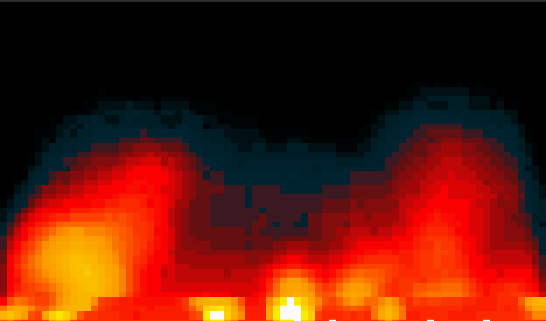
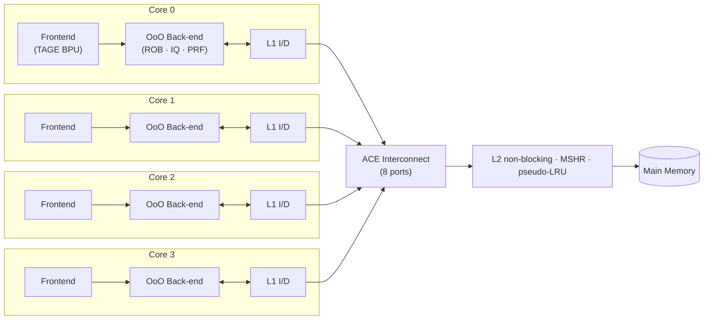
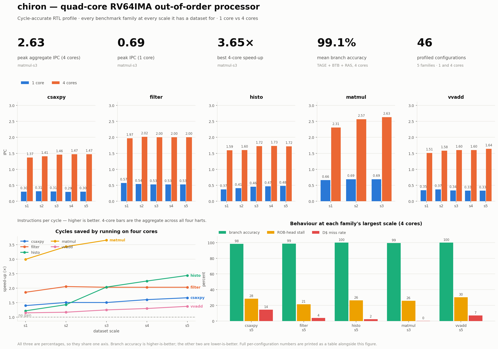
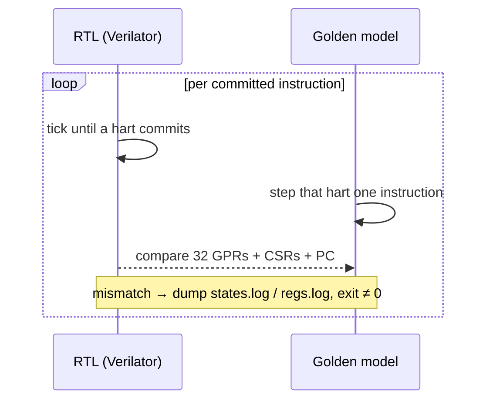

<div align="center">


# Chiron

### A quad-core RV64IMA out-of-order processor, in Chisel

*In ancient lore **Chiron** (Kai-ron) was the wisest of the Centaurs — not a wild brute,*
*but a gentle healer and the supreme teacher of heroes: Achilles, Heracles, Jason.*
*He walks on four limbs (a **quad-core** lineage) yet his legacy is to **educate**.*
*This core is built in that spirit — a teaching-grade, fully verified OoO machine.*

<br/>


</div>

---

## Highlights

- **Quad-core** RV64IMA — 4 independent OoO harts sharing a **non-blocking L2**
  and an **ACE coherent interconnect** (8 ports, 2 per core).
- **Out-of-order** pipeline per core — register renaming, a reorder buffer, a
  centralized issue queue with wake-up, and in-order commit.
- **Full memory hierarchy** — split L1 I/D caches, non-blocking L2 with MSHRs
  and pseudo-LRU, ACE-style coherent interconnect.
- **Modern branch prediction** — a 1024-entry tagged BTB drives next-PC in the
  fetch cycle (a hit *is* the prediction, since the BTB is only written on a
  taken resolve), backed by a 1024-entry pre-decode CFI classifier, a 16-deep
  RAS, and a **4-table TAGE** (512 entries each, histories 4/9/19/40) over a
  2048-entry bimodal base that arbitrates as a next-cycle override.
  **85–100 % accuracy across the benchmark sweep.**
- **Cycle-accurate, lock-step verified** against a C++ golden-model emulator,
  one committed instruction at a time — **84/84 official `riscv-tests` pass**.
- **Boots quad-core Linux SMP to an interactive shell** — a nommu RISC-V kernel
  brings up all four harts, runs userspace, and answers `nproc` with `4`, typed
  live at the console (`docs/linux-quad-boot.log`).
- **Fast enough to actually boot it** — the Verilated model runs at **~40 K RTL
  cycles/s** (4-threaded, `-O3`), so a 3-billion-cycle Linux boot finishes in a
  day rather than a week, and it checkpoints so you never repeat one.
- **One command per task.** No copying files around: every harness loads images
  by path, driven from a single benchmark manifest.
- **164 hardware performance counters** exposed from the RTL (41 per core × 4)
  — IPC, branch accuracy, cache miss rates, ROB-head stall decomposition,
  per-class latency attribution.

---

## See it run

```bash
make fire            # bare-metal Doom-fire demo, UART → terminal
make cube            # rotating wireframe cube, software 3D on four harts
```

Both render over the UART with truecolor escapes — no framebuffer, no FPU.
`workloads/demos/g3d/` is a small fixed-point 3D library (matrices, projection,
line and triangle raster) written for exactly this: the harts transform vertices
in parallel and core 0 rasterises and presents.

<div align="center">

</div>

---

## Microarchitecture


```mermaid
flowchart LR
    subgraph C0["Core 0"]
      direction TB
      FE0["Frontend\n(TAGE BPU)"] --> BE0["OoO Back-end\n(ROB · IQ · PRF)"]
      BE0 <--> MH0["L1 I/D"]
    end
    subgraph C1["Core 1"]
      direction TB
      FE1["Frontend"] --> BE1["OoO Back-end"]
      BE1 <--> MH1["L1 I/D"]
    end
    subgraph C2["Core 2"]
      direction TB
      FE2["Frontend"] --> BE2["OoO Back-end"]
      BE2 <--> MH2["L1 I/D"]
    end
    subgraph C3["Core 3"]
      direction TB
      FE3["Frontend"] --> BE3["OoO Back-end"]
      BE3 <--> MH3["L1 I/D"]
    end

    MH0 & MH1 & MH2 & MH3 --> IC["ACE Interconnect\n(8 ports)"]
    IC --> L2["L2 non-blocking · MSHR · pseudo-LRU"]
    L2 --> RAM[(Main Memory)]
```

### Per-core parameters

| Property | Value |
|---|---|
| ISA | RV64IMA (no F/D/V/C) |
| Reorder buffer | 16 entries |
| Physical registers | 64 (LVT-based rename) |
| Issue queue | 8 entries, centralized |
| Commit width | 1-wide (decode is also 1-wide) |
| Divider | Radix-4 (2 bits/cycle), clz-normalized, /0 /1 /small early-out |
| L1 I-Cache | Direct-mapped · 64 lines · 16-instr (4 KB) |
| L1 D-Cache | 4-way · 256 sets · 64-byte lines (64 KB) |
| Branch predictor | Bimodal + BTB + 4×512 TAGE |
| Clock target | 75 MHz |

### System parameters

| Property | Value |
|---|---|
| Cores | 4 (hart IDs 0–3) |
| Coherence | ACE — 2 ports per core (8 total) |
| L2 Cache | Non-blocking · MSHR · pseudo-LRU |
| UART | MultiUart (one per core) |
| RAM base | `0x8000_0000` (sim) · `0x4000_0000` (Zynq) |

---

## Repository layout

```
chiron/
├── src/main/scala/        # Chisel RTL — grouped by pipeline function:
│   ├── Frontend/          #   fetch + branch prediction (TAGE/BTB)
│   ├── Decode/            #   decode + register rename
│   ├── Backend/           #   OoO execution: Rob · Prf · Scheduler · StoreDataIssue
│   ├── pipeline/          #   shared port/fifo bundles (pipeline.ports / .fifo)
│   ├── Icache/            #   L1 instruction cache (+ shared AXI bundle)
│   ├── Dcache/            #   L1 non-blocking data cache
│   ├── L2_cache/          #   shared non-blocking L2 (MSHR · pseudo-LRU)
│   ├── Interconnect/      #   ACE coherence unit (CCU)
│   ├── common/            #   configuration / parameters
│   ├── testbench/         #   system top, main memory model, UARTs
│   └── core.scala         #   per-core top-level (frontend → backend → L1)
├── sim/                   # all host-side C++ (golden model · RTL wrapper · drivers)
│   ├── emulator/          #   C++ golden-model ISA simulator (4-hart, lock-step ref)
│   │   ├── hart.h         #     one hart — split into hart_{csr,trap,alu,memory,execute}.inc
│   │   ├── emulator.h     #     4-hart container
│   │   └── terminal.h · clint.h · constants.h
│   ├── rtl/               #   Verilator RTL wrapper
│   │   ├── rtl_model.h    #     single-core (core 0) signal accessors + stepping
│   │   └── profiler.h · profiler_quad.h   # perf-counter read-out
│   ├── harness/           #   test/run drivers
│   │   ├── common/        #     shared helpers: args.h · image.h · completion.h
│   │   ├── lockstep.cpp   #     RTL-vs-emulator lock-step (core 0)
│   │   ├── lockstep_quad.cpp  #     4-hart lock-step (q4 benches)
│   │   ├── lockstep_isa.cpp   # ISA regression completion
│   │   ├── lockstep_linux.cpp # Linux-boot variant
│   │   ├── profile.cpp    #     single-core cycle-accurate profiler
│   │   ├── profile_quad.cpp   # quad-core profiler (all 4 cores + aggregate IPC)
│   │   └── fire.cpp       #     bare-metal UART → terminal streamer
│   ├── tests/riscv-isa/   #   ISA regression images (images · avoid · dumps)
│   └── data/              #   runtime inputs: Image · qemu.dtb · boot.bin
├── workloads/
│   ├── benchmarks/        # benchmark sources (vvadd · matmul · filter · csaxpy · histo)
│   └── demos/             # bare-metal demos (fire 🔥)
├── bins/                  # staged .bin images
│   ├── mt-*-s1..s5.bin    #   single-core scaled variants
│   ├── mt-*-sN-q4.bin     #   quad-core scaled variants (NUM_CORES=4)
│   └── mt-*-q4.bin        #   default-scale alias, refreshed when bins are built
├── mk/                    # modular makefiles
│   ├── config.mk          #   paths, compiler flags, SHOW_STATE / DUMP_WAVES vars
│   ├── benchmarks.mk      #   benchmark manifest (done-PCs, families)
│   ├── rtl.mk             #   Chisel → Verilog → Verilator
│   ├── bins.mk            #   single-core .bin build + stage
│   ├── bins_quad.mk       #   quad-core .bin build + stage (NUM_CORES=4)
│   └── run.mk             #   all harness build + run targets
├── scripts/               # profiling visualisation, log decoders
├── build/                 # all generated artifacts (gitignored)
└── Makefile               # thin orchestrator — one entry point per task
```

---

## Quick start

### Prerequisites

```bash
sudo apt install verilator sbt make g++ python3
# RISC-V toolchain must be on PATH (riscv64-unknown-elf-gcc)
# If sbt hangs on file watches:
make fix-inotify
```

### Step 1 — Build the RTL

```bash
make sim        # traced model (ISA lock-step, DUMP_WAVES)
make sim-fast   # no-trace -O3 model (benches, ci-check, linux-sim-fast)
```

> `make sim` fails if `sbt` fails. It will not copy a stale `system.v`.
> `make linux-sim` needs `make sim-ckpt` (same RTL with `--savable`).

### Everyday RTL gate

After any frontend/backend change:

```bash
make gate            # lockstep vvadd-s1 + vvadd-q4, compared to testdata/baseline/q4
make compare         # re-score whatever JSON is already in build/profile_results
make regress-q4      # all five q4 benches, then compare (slow)
make snapshot-baseline   # refresh testdata/baseline/q4 from the current JSONs
```

`profile_quad` now scrapes `The code is ran with error code: N` from UART
and exits 4 if N is nonzero — a done-PC hit with a wrong result array is a
fail, not a silent pass. The JSON `result.bench_error` field records it.

---

## Running in single-core mode

Single-core runs use the pre-built `bins/mt-*-s<scale>.bin` images (compiled with
`NUM_CORES=1`). The benchmark name is `<family>-s<scale>` where scale 1 is smallest.

### Lock-step verification (correctness)

Compares RTL output against the golden emulator instruction-by-instruction:

```bash
make lockstep BENCH=vvadd-s1     # smallest, fastest (~30 s)
make lockstep BENCH=csaxpy-s2    # ~5 min
make lockstep BENCH=matmul-s2    # ~8 min
make lockstep-q4 BENCH=vvadd-s1  # same image as profile-quad; all 4 harts
make lockstep BENCH=vvadd-s1-q4  # identical to lockstep-q4 (existing target)
```

Logs are written to `build/run.log`, `build/states.log`, `build/regs.log`.
`DUMP_WAVES=1` adds `build/system_trace.vcd`.

### Cycle-accurate profiling (IPC)

```bash
make profile BENCH=vvadd-s1      # → build/profile_results/vvadd-s1.json
make profile BENCH=csaxpy-s3
```

### Profile all single-core scales (s1–s5) for all benchmarks

```bash
make profile-all-sc              # → build/profile_results/<fam>-s<N>.json + chart
```

#### Single-core benchmark profile (s1 scale)

<div align="center">

</div>

| Benchmark | Cycles | IPC | Branch Acc | D$ Miss | DRAM RD BW |
|---|---|---|---|---|---|
| filter-s1 | 482 231 | **0.492** | 77.5 % | 3.82 % | 3.01 MB/s |
| matmul-s1 | 938 727 | **0.331** | 11.1 % | 0.34 % | 0.46 MB/s |
| histo-s1 | 581 807 | **0.275** | 78.0 % | 3.92 % | 3.83 MB/s |
| vvadd-s1 | 69 657 | **0.272** | 71.7 % | 7.11 % | 6.13 MB/s |
| csaxpy-s1 | 62 211 | **0.233** | 62.9 % | 6.47 % | 6.17 MB/s |

> Single-core IPC sits at 0.23–0.49, with branch accuracy 63–78 % on the
> streaming kernels — the TAGE frontend is most of that. filter leads because
> its stencil inner loop is long and well-predicted; csaxpy trails because at
> `s1` the kernel is only ~62 K cycles, so loop prologue and the barrier
> dominate what little work there is.
>
> **`s1` is the smallest scale and flatters nothing** — the D$ miss rates above
> are cold-start artefacts (vvadd's 7.1 % falls out of a 70 K-cycle run whose
> working set is touched exactly once). Read the scaling curves in
> `docs/profile_report.png` for steady-state behaviour.
>
> matmul-s1's 11.1 % branch accuracy is the trip-count-3 inner loop: at this
> size almost every branch is a fresh one TAGE never sees twice. It is a
> small-input artefact, not a predictor limit — the same kernel reaches
> **67.6 % at s2 and 98.9 % at s3** as the loops get long enough to learn.

---

## Running in quad-core mode

Quad-core runs use the restaged `bins/mt-*-sN-q4.bin` images (`NUM_CORES=4`).
`make bins-scale` / `make bins-scale-q4` also write the unscaled
`mt-*.bin` / `mt-*-q4.bin` names from each family's default scale, so those
paths stay on the same `crt.S` as the done-PC table. All 4 harts execute
cooperatively; the profiler reads all 164 performance counters.

### Quad-core profile for a single benchmark

```bash
make profile-quad FAM=vvadd      # → build/profile_results/vvadd-q4.json
make profile-quad FAM=csaxpy
make profile-quad FAM=matmul
make profile-quad FAM=filter
make profile-quad FAM=histo
```

### All quad-core benchmarks + chart

```bash
make profile-all                 # profiles every family, generates profile_report.png
```

### HTML performance dashboard

`make dashboard` is post-processing only: it reads profiler JSON and writes a
self-contained `build/chiron_dashboard.html` (no new sims, no extra libraries).
Open that file in a browser.

```bash
make profiles                    # five max-scale q4 benches → build/profiles/*.json
make dashboard                   # → build/chiron_dashboard.html
```

If the JSON is already on disk, skip `make profiles`. Point it at the full
sweep instead of the default five-bench set:

```bash
make dashboard PROFILE_DIR=build/profile_results
```

`PROFILE_DIR` defaults to `build/profiles/`. `DASHBOARD` defaults to
`build/chiron_dashboard.html`. The PNG chart is a different target:
`make profile-report` redraws `docs/profile_report.png` from
`build/profile_results/` (also no new sims).

### Quad-core pass/fail regression

```bash
make test-q4                     # profile-based pass/fail on vvadd-q4
```

---

## Profiling values — reference numbers

Measured on the current RTL over the full sweep (`make profile-sweep`,
**2026-08-22**, 46 configurations, all completing with `error code: 0`); the
figures below are the `s1` scale, and `docs/profile_report.png` covers every
family at every scale, single-core and quad-core.

> **These numbers are not comparable to any published before 2026-08-22.** The
> branch predictor was being trained with the *wrong PC*: `fetch.branchRes` took
> `fired`/`pcAfterBrnach` from the registered `branchEvals` stage but
> `pc`/`instruction`/`branchTaken` combinationally from the earlier
> `branchInstruction` stage, and `branchPCs` has already shifted by then. Every
> BTB write was `BTB[pc of the NEXT branch] := target of THIS branch`, and TAGE,
> bimodal and the CFI table were indexed with the same wrong PC. Only tight 1–2
> instruction loops looked healthy, because there `pc(k+1) == pc(k)` and the
> off-by-one trained the right entry by accident — which is why accuracy used to
> scale *backwards* with BTB size. Fixing it moved branch accuracy from as low
> as 43.6 % to **85–100 %** and aggregate quad-core IPC from **0.77–2.27** to
> **1.27–2.54**. Compare against this sweep, not the old one.

**Quad-core aggregate IPC, every family and scale:**

| family | s1 | s2 | s3 | s4 | s5 |
|---|---|---|---|---|---|
| matmul | 2.157 | 2.467 | **2.537** | — | — |
| filter | 1.849 | 1.905 | 1.893 | 1.893 | 1.893 |
| histo  | 1.486 | 1.447 | 1.622 | 1.568 | 1.581 |
| vvadd  | 1.344 | 1.405 | 1.440 | 1.448 | 1.468 |
| csaxpy | 1.267 | 1.294 | 1.367 | 1.390 | 1.369 |

Single-core IPC spans 0.249–0.684 over the same 46 runs (decode, issue and
commit are all 1-wide, so 1.0 is the per-core ceiling).

### vvadd-s1-q4 (vector-vector add, all 4 cores)

| Metric | Aggregate | Core 0 | Cores 1–3 |
|---|---|---|---|
| **IPC** | **1.344** | 0.196 | ~0.383 |
| Instructions retired | 83 514 | 12 195 | ~23 773 each |
| Max cycles | 62 129 | — | — |
| Branch accuracy | — | 99.6 % | ~99.9 % |
| D-cache miss rate | — | 14.8 % | ~3.5 % |
| ROB stall % | — | 63.9 % | ~17.2 % |
| Decode efficiency | — | 23.6 % | ~69.1 % |

> Core 0 acts as the coordinator (barrier + result check), hence its lower IPC
> and high ROB stall fraction. Cores 1–3 execute the compute kernel.
> vvadd-s1-q4 is only 62 K cycles end to end, so fixed startup cost is a large
> share of it; `vvadd-s5-q4` reaches **1.468** aggregate IPC on the same code.

### histo-s1-q4 (histogram, all 4 cores)

| Metric | Aggregate | Core 0 | Cores 1–3 |
|---|---|---|---|
| **IPC** | **1.486** | 0.247 | ~0.413 |
| Instructions retired | 600 929 | 99 883 | ~167 015 each |
| Max cycles | 404 273 | — | — |
| Branch accuracy | — | 97.7 % | ~98.1 % |
| D-cache miss rate | — | 6.8 % | ~1.2 % |
| ROB stall % | — | 57.6 % | ~10.0 % |

> histo used to be the weakest family precisely because it was the one hurt most
> by the training bug: its scatter kernel's loop bodies are too long for
> `pc(k+1) == pc(k)` to mask an off-by-one, so the worker harts predicted at
> **43.6 %** and the family sat at 0.768 aggregate IPC. With the BTB trained on
> the right PC they run at ~98 % and the family is at **1.486** — a 93 % gain,
> the largest in the suite.

---

## Debugging features

### Print internal state each step (`SHOW_STATE`)

Prints the golden-model register file after every committed instruction — useful
for diagnosing mismatches or tracing program flow:

```bash
make lockstep BENCH=vvadd-s1 SHOW_STATE=1
make lockstep-q4 BENCH=vvadd-s1 SHOW_STATE=1
```

Works on `lockstep` and `lockstep-q4`. Writes to stdout alongside the existing log files.

### Capture waveforms (`DUMP_WAVES`)

Writes a VCD waveform to `build/system_trace.vcd` for viewing in GTKWave:

```bash
make lockstep BENCH=vvadd-s1 DUMP_WAVES=1
make lockstep-q4 BENCH=vvadd-s1 DUMP_WAVES=1
# Then open:
gtkwave build/system_trace.vcd
```

> **Performance note:** VCD generation enables Verilator signal instrumentation
> (`traceEverOn`), which substantially increases simulation overhead. Use only
> when you need waveforms; omit it for routine lock-step runs.

Both flags can be combined:

```bash
make lockstep BENCH=csaxpy-s2 SHOW_STATE=1 DUMP_WAVES=1
make lockstep-q4 BENCH=vvadd-s1 SHOW_STATE=1 DUMP_WAVES=1
```

---

## Full regression

```bash
make test
```

Runs in two stages:

- **ISA suite** (`make isa`) — 84 official `riscv-tests` images, lock-step RTL
  vs golden model. Progress is printed per-test. Expected result: **84/84**.
  (`rv64ui-p-fence_i` was the long-standing exception; it passes now that the
  D-cache writes dirty lines back to L2 on `fence.i`.)
- **Quad-core vvadd** (`make test-q4`) — profile-based pass/fail on
  `bins/mt-vvadd-q4.bin`.

Two further gates cover the multi-core paths that the ISA suite, being
single-hart, cannot reach:

- **`make ci-bench`** — all five quad-core benchmark families must complete
  cleanly.
- **`make smp-repro`** — bare-metal reproductions of the failures found while
  bringing up Linux SMP: an illegal-instruction trap and cross-hart code
  publication (`fence.i`), each with a control build that is *expected* to fail.

---

## Verification — lock-step

Correctness is proven by running the **RTL** and the **C++ golden model** in
lock-step, comparing architectural state after **every committed instruction**:


```mermaid
sequenceDiagram
    participant R as RTL (Verilator)
    participant G as Golden model
    loop per committed instruction
        R->>R: tick until a hart commits
        G->>G: step that hart one instruction
        R-->>G: compare 32 GPRs + CSRs + PC
        Note over R,G: mismatch → dump states.log / regs.log, exit ≠ 0
    end
```

`make lockstep` compares core 0 (single-core images). `make lockstep-q4`
(or `make lockstep BENCH=…-q4`) compares all four harts. `make linux-lockstep`
is the same 4-hart compare on a Linux image (bounded). Divergences dump
`run.log`, `states.log`, `regs.log` to `build/` for debugging.

Lock-step asks only "is the architectural state right?". Two further layers
sit above it:

| Gate | Question it answers |
|---|---|
| `make ci-check` | Did the *microarchitecture* stay self-consistent? Per-cycle assertions (`sim/harness/invariants.h`) catch a completion landing on a ROB slot speculation already reallocated — the bug shape behind four separate wedges in this design. |
| `make linux-check` | Does it still survive a *kernel*? The same assertions, but on a booting Linux instead of five numeric kernels — plus a check that no D-cache request was silently dropped. A green benchmark suite does not validate a speculation-path change. |
| `make stress-sweep` | Seeded constrained-random programs aimed at the speculation corners the directed benchmarks never reach (divides in branch shadows, speculative MMIO, cross-hart AMO/LR-SC). |

**See [VERIFICATION.md](VERIFICATION.md)** for what each layer proves, the exact
toolchain versions results were produced with, the defect taxonomy, and — read
this before trusting any of it — the known gaps.

---

## Performance counters

The RTL exposes 41 counters per core (164 total). The profiler aggregates them
into:

| Metric | Source |
|---|---|
| IPC | `inst_retired / cycles` |
| Aggregate IPC (quad) | `Σ(inst_retired) / max(cycles)` |
| Branch accuracy | `branches_passed / branch_total` |
| D-cache miss rate | `dcache_miss / dcache_reqs` |
| I-cache miss rate | `icache_miss / decode_ready` |
| Scheduler stall % | `scheduler_stalls / decode_ready` |
| ROB stall % | `rob_stalls / decode_ready` |
| Decode efficiency | `decode_fired / decode_ready` |
| DRAM read BW | `l2_to_mem_rd_beats × 8 B × 75 MHz` |

JSON reports are written to `build/profile_results/`.

---

## Timing reference (Verilator, ~42 K RTL cycles/sec)

Measured on an 8-core host with the 4-threaded fast model, one simulation at a
time. Lock-step runs are far slower than this — they step a golden model in
parallel and compare every retired instruction.

| Run | Cycles | Approx wall time |
|---|---|---|
| `make profile-sweep` (all 46 configs) | 100 268 018 | ~45 min at `PSWEEP_JOBS=2` |
| matmul-s3 (single-core, longest run) | 40 990 627 | ~18 min |
| matmul-s3-q4 | 15 611 545 | ~7 min |
| filter-s5 / filter-s5-q4 | 2.9 M / 1.6 M | ~75 s / ~45 s |
| vvadd-s1-q4 (shortest) | 57 375 | ~2 s |
| Full quad-core Linux boot to login | ~3.06 G | ~21 h |

**`PSWEEP_JOBS` is not `nproc`.** The fast model is Verilated with
`--threads $(VTHREADS)`, so one simulation already occupies `VTHREADS` cores and
the sweep must run `nproc / VTHREADS` at a time. Verilator's thread pool
busy-waits, so oversubscribing collapses throughput rather than merely flattening
it — measured here, 2 jobs gives ~1.79× over serial, while 4 jobs gives **0.22×,
i.e. 4.5× slower than running them one at a time**. The default now computes
this; override only if your host is bigger than the arithmetic.

---

## Make target reference

| Target | What it does |
|---|---|
| `make sim` | Traced RTL model (ISA lock-step, `DUMP_WAVES`) |
| `make sim-fast` | No-trace `-O3` model (benches, `ci-check`, `linux-sim-fast`) |
| `make sim-ckpt` | Fast model + `--savable` (`linux-sim` checkpoints) |
| `make bins` | Demos + all single-core `s1`–`s5` benches (and unscaled defaults) |
| `make bins-q4` | All quad-core `s1`–`s5` benches + diagnostic micros |
| `make bins-scale` / `bins-scale-q4` | Just the scale matrices (same images `bins` / `bins-q4` build) |
| `make bins-all` | `bins` + `bins-q4` |
| `make emu BENCH=…` | Run that bench on the golden emulator; exits at the done-PC |
| `make lockstep BENCH=…` | Lock-step RTL vs emulator; logs in `build/` (`*-q4` uses the 4-hart harness) |
| `make lockstep-q4 BENCH=…` | 4-hart lock-step of the matching `-q4` image (same logs / flags) |
| `make lockstep … SHOW_STATE=1` | Same, plus per-step golden-model register dump |
| `make lockstep … DUMP_WAVES=1` | Same, plus VCD to `build/system_trace.vcd` |
| `make isa` | Full RISC-V ISA regression (84/84 expected) |
| `make test` | ISA suite + quad-core vvadd pass/fail |
| `make test-q4` | Quad-core vvadd only (fast model) |
| `make ci-bench` | 5 max-scale quad-core benches must complete cleanly |
| `make ci-check` | Same 5, plus per-cycle microarchitectural assertions |
| `make gate` | Everyday gate: lockstep vvadd-s1 + vvadd-q4 vs baseline |
| `make compare` | Diff `build/profile_results` against `testdata/baseline/q4` |
| `make smp-repro` | Illegal-instruction trap + cross-hart `fence.i` |
| `make linux-check` | Pre-boot gate: per-cycle invariants **on a booting kernel** + D-cache request accounting (`LINUX_CHECK_CYCLES`) |
| `make uartrx-test` | Console-input (uartlite RX) round trip through the RTL |
| `make profile BENCH=…` | Single-core cycle-accurate profile (fast model) |
| `make profile-quad FAM=…` | Quad-core profile for one family at its default scale (fast model) |
| `make profile-all` | All five families at their default scale + chart |
| `make profile-all-sc` | Single-core, every family × every scale |
| `make profile-sweep` | Full single + quad sweep (every family/scale) |
| `make profile-report` | Redraw `docs/profile_report.png` from existing JSON (no new sims) |
| `make profiles` | Five max-scale q4 benches → `build/profiles/*.json` |
| `make dashboard` | Render `build/chiron_dashboard.html` from `PROFILE_DIR` (default `build/profiles`) |
| `make fire [FIRE_FRAMES=N]` | Bare-metal Doom-fire demo |
| `make cube [FIRE_FRAMES=N]` | Rotating wireframe cube (fixed-point 3D, 4 harts) |
| `make solid [FIRE_FRAMES=N]` | Filled, shaded rotating cube |
| `make linux-emu [LINUX_IMAGE=…]` | Interactive Linux shell on the golden model (fast) |
| `make linux-emu-check [LINUX_IMAGE=…]` | Scripted boot-to-login check (CI, non-interactive) |
| `make linux-sim [LINUX_IMAGE=…]` | Boot Linux on the savable RTL model (needs `sim-ckpt`) |
| `make linux-sim DEBUG=1` | Same, plus a harness log and 20 M-cycle checkpoints |
| `make linux-sim RESUME=1` | Continue from the newest checkpoint |
| `make linux-sim-fast [LINUX_IMAGE=…]` | Same boot on the non-savable fast model (needs `sim-fast`) |
| `make linux-ckpts` | List checkpoints available to resume from |
| `make linux-lockstep [LINUX_IMAGE=…]` | Bounded RTL-vs-emulator lock-step of the Linux boot |
| `make clean` | Remove generated artifacts (`build/`, `obj_dir`, logs) |
| `make distclean` | `clean` + drop sbt/Verilator build trees |
| `make help` | List all targets with descriptions |

`BENCH` = `<family>-s<scale>`. `FAM` = `<family>` alone (no scale).  
Families: `vvadd matmul filter csaxpy histo`. Scales: `s1`–`s5`. Default `BENCH`: `vvadd-s1`.

> The benchmark manifest (`mk/benchmarks.mk`) is the single source of truth for
> done-PCs and family names. Adding a workload is a one-line edit — no harness
> copy-paste required.

---

## Booting Linux (nommu, single-core & quad-core SMP)

chiron boots real Linux — a nommu, M-mode RISC-V kernel wrapped in bbl as a
flat binary loaded at `0x80000000`. Images are produced by the
[`mc-linux/`](mc-linux/) submodule (full pipeline and
every chiron-specific knob documented in its README):

```
cd mc-linux
./submodule_update                       # clone linux/ buildroot/ riscv-pk/
cd buildroot && make -j$(nproc) && cd .. # toolchain + rootfs (slow, once)
export RISCV=$PWD/buildroot/output/host
./apply_configs_and_patches              # stage chiron configs + patches
./build_image.sh s1                      # -> bins/linux-s1.bin (single-core)
./build_image.sh q4                      # -> bins/linux-q4.bin (quad-core SMP)
```

Then, from this repo root (`linux-sim-fast` needs `make sim-fast`; `linux-sim` needs `make sim-ckpt`):

```
make linux-emu                             # quad-core shell on the golden model (default image)
make linux-emu  LINUX_IMAGE=bins/linux-s1.bin   # single-core variant
make linux-sim-fast                        # fastest RTL boot (no checkpoints)
make linux-sim-fast LINUX_MAX_CYCLES=50000000 \
                    LINUX_PROFILE_OUT=build/linux-profile.json
                                           # bounded window: IPC / I$ / D$ / branch
                                           # counters on stderr (guest console stays stdout)
make linux-sim                             # same boot on the savable model
```

- **`linux-emu`** attaches the golden-model emulator to your terminal: it
  reaches `buildroot login:` in about a minute; log in as `root` (no password) —
  interactive input works (emulator UART RX + the kernel uartlite RX-poll patch).
  `linux-emu-check` is the non-interactive CI variant of the same boot.
- **`linux-sim-fast`** is the same RTL boot on the non-savable fast model
  (`obj_dir_fast`, `-O3 -march=native`, no `--savable`). Use this when you want
  the highest cycles/s this host can deliver. `DEBUG=1` still writes a
  heartbeat log; `RESTORE` / `RESUME` are refused — those need `linux-sim`.
- **`linux-sim`** boots the image on the Verilated RTL with a live uartlite
  console, and **stdin is wired through** — you can log in and run commands.
  Expect **~40 K cycles/s** on the savable model (it is Verilated with
  `--threads` too — `--savable` and `--threads` coexist, so checkpointing costs
  no speed). A full boot to the login prompt is ~3 billion cycles, i.e. the
  better part of a day; the kernel banner shows up in the first few minutes.
  **Its stdout is the guest console and nothing else**, so
  `make linux-sim | tee boot.log` produces a log of the boot rather than a log
  of the harness. `make uartrx-test` is the fast regression for the
  console-input path.

  A run that long should not have to be repeated from cycle zero, so the
  savable harness can snapshot itself:

  ```bash
  make linux-sim DEBUG=1            # + harness log (build/linux-sim.log) and a
                                    #   checkpoint every 20 M cycles
  make linux-ckpts                  # what is available to resume from
  make linux-sim DEBUG=1 RESUME=1   # continue from the newest checkpoint
  make linux-sim RESTORE=<file>     # or from a specific one
  ```

  `DEBUG=1` also turns on the progress heartbeat — cycles, steps/s, and all
  four harts' PCs every 100 K cycles — which is what distinguishes a slow boot
  from a wedge. It flags harts whose PC band is both tiny and unchanged
  between windows, the signature of a livelock. All of it goes to the log file;
  none of it touches the console.

  Checkpoints are ~256 MB each (the model contains all of DRAM), so `CKPT_KEEP`
  prunes to the newest 8 and none are written without `DEBUG=1`. Restoring is
  cycle-exact: a resumed run reproduces the original's step count and per-hart
  PCs beat for beat. A checkpoint is only valid for the netlist that wrote it —
  any RTL change invalidates every one, and the harness refuses to load a
  foreign or stale file rather than restoring garbage.
- `LINUX_IMAGE` defaults to `bins/linux-q4.bin` (see `mk/run.mk`).

**Status (2026-08-17): the quad-core image boots to an interactive shell on the
RTL.** All four harts come online, `/init` runs, and `nproc` answers `4` typed
live at the console — `docs/linux-quad-boot.log` is that boot, captured from
`make linux-sim DEBUG=1` on the current netlist.

Booting a real SMP kernel turned out to be the sharpest verification tool in the
project: it exercises coherence, speculation, and traps in combinations no
directed test reached, and every failure below was invisible to the ISA suite.
In the order they were found and fixed:

1. **CCU/L2 snoop starvation** — the D-cache clean-on-fence walker starved snoop
   requests behind its writebacks in the CCU's single serialized transaction
   FIFO. Fixed with a dedicated `readyCoherency` snoop path plus a flush-walker
   interlock.
2. **ROB livelock on coherent-load squash** — a snoop invalidating a load
   between D-cache response and commit triggered a whole-ROB rollback the FIFO's
   pointer arithmetic could not represent (`full` vs `empty` ambiguity), freezing
   the hart. Fixed with an explicit `flushAll` in `pipeline/Fifo.scala`.
3. **Two harts holding one line Unique** — the snoop path answered out of the
   writeback pipeline, which is correct for an eviction but not for a `fence.i`
   walker writeback, where the L1 still owns the line and may have stored into
   it since. Peers were handed pre-store data *with `PassDirty`*, silently losing
   a committed store. Fixed with the `retain` bit in `Dcache/traits.scala`.
4. **No illegal-instruction trap** — nothing drove `exceptionOccurred`, so a bad
   jump filled the ROB with zeros and stopped forever instead of faulting. The
   core now traps (`mcause=2`); `mt-illegal` is the regression, and note that
   pre-fix RTL *hangs* on it rather than failing.
5. **The D-cache request scheduler dropped requests on the floor.** Its enqueue
   is `when(!fullReg) { ... }` with no retry, while the only backpressure
   (`canAllocate` → `scheduler.memoryReady`) is sampled by the core's *issue*
   scheduler several register stages upstream. A memory op already inside that
   shadow when the queue filled was silently discarded; it never reached the
   cache, so its ROB entry reached the head and waited forever for a write
   commit nobody would produce. Measured on the boot: 14 stores of 63 236
   dropped in 2.75 M cycles, and the last one wedged the hart in `__memset`.
   Fixed with `hasHeadroom` in `Dcache/fifo.scala`. Only *reachable* once branch
   accuracy rose enough to keep 16 requests in flight — a faster machine found a
   bug a slower one could not.

### IPC accounting on the boot

`make linux-sim DEBUG=1` is the profiling stage: it writes the 164 performance
counters to `build/linux-profile.json` (rewritten every 20 M cycles, so the file
survives a kill), appends a compact IPC/I$/D$/branch line to the debug log at the
same cadence, and mirrors the kernel's own console into that log as `[guest] …`
so the boot narrative, the checkpoint bookkeeping and the counters share one
timeline. `linux-sim-fast` deliberately does *not* get these defaults — bounded
IPC windows there stay opt-in via `LINUX_PROFILE_OUT`.

All harness output — the periodic `[prof]` lines, the final counter summary and
the profiler's own "JSON written to" note — goes to the **log, not the terminal**,
because a booting kernel owns the terminal. Without a debug log (a bounded
`--max-cycles` window on `linux-sim-fast`) they fall back to stderr, since that
is then the only sink there is.

### Before a long boot: `make linux-check`

```bash
make linux-check                               # 40 M cycles, ~26 min
make linux-check LINUX_CHECK_CYCLES=100000000  # deeper, for an invasive change
```

Two gates, both exiting nonzero on failure:

1. **Per-cycle invariants on a real kernel** — `ci-check`'s assertions
   (branch-readied-without-resolution, ready-outside-ROB-window, double-resolve,
   wedge) across all four harts.
2. **D-cache request accounting** — `storeDROPPED` must be 0. A dropped request
   is *silent*: it wedges a hart millions of cycles later, and only sometimes, so
   the counter is the detector and the hang is merely the eventual symptom.

Why this exists separately from `ci-check`: those five benchmarks are tight
numeric kernels with no traps, no CSR work and no cross-hart IPI. **A green suite
does not validate a speculation-path change** — the injFSM escape fix passed ISA
84/84, `ci-bench` 5/5 and two open repros, and still killed the boot. Both bugs
fixed on 2026-08-22 were invisible to every existing gate and only reachable with
a kernel running.

The recommended ladder after any non-trivial RTL change, cheapest first so it
fails fast — roughly 70 minutes to protect a multi-hour boot:

```bash
make isa && make ci-bench && make ci-check && make smp-repro && make linux-check
```

> **Run it on an idle box.** Verilator's thread pool busy-waits, so a concurrent
> `profile-sweep` (2 jobs x 4 threads on 8 cores) costs ~4x throughput — measured
> 42 106 cycles/s solo vs ~9 100 contended, on byte-identical RTL.

> **What it does not cover:** 40 M cycles is ~1.3 % of a ~3 G-cycle boot. It
> reaches mm init, not userspace or `/init` — historically where the csd hang and
> the `rt_sigreturn` trampoline bug lived. It raises confidence; it does not
> replace the boot.

One bug turned out not to be ours: on nommu RISC-V the kernel writes the
`rt_sigreturn` trampoline to the user stack with `copy_to_user` and jumps to it
without a `FENCE.I`. That is invisible on a machine whose I-fetch snoops the
D-caches; on chiron the fetch reads stale L2. The two-line kernel fix lives in
[`mc-linux/patches/`](mc-linux/patches/).

All of the above hold under the full suite: ISA 84/84, `ci-bench` 5/5,
`ci-check` 5/5, `smp-repro` 3/3.

---

## Known issues

- **`mask-sfilter` only has three distinct scales.** `s3.h`, `s4.h` and `s5.h`
  are byte-identical (`DATA_SIZE 156`), so `filter-s3`, `-s4` and `-s5` build the
  same image and unsurprisingly profile to the same number (1.893 aggregate IPC
  and 1 598 019 cycles at all three, bit-for-bit). The flat tail of filter's
  scaling curve is a dataset artifact,
  not a saturation effect. Regenerating the larger datasets with
  `mask-sfilter_gendata.py` would fix it, at the cost of re-deriving that
  family's completion PCs and re-running the sweep.

---

## Roadmap

- Aggregate quad-core IPC now spans **1.27–2.54** across the five families
  (see `docs/profile_report.png`), i.e. roughly 0.32–0.63 per core. Branch
  prediction is no longer the limiter anywhere in the suite (85–100 %); the
  floor is now csaxpy at 1.27, which is memory-bound, not branch-bound.
- **Store commit is serialised.** `writeCommit`/`writeInstructionCommit` are
  untagged 1-bit handshakes, so the arbiter parks in `writeInstructionFiredState`
  until the ROB commits — exactly one store in flight at a time. A hitting store
  costs ~6 cycles and a missing one ~60, with no overlap, which is why a pure
  store stream (`memset` during Linux boot) shows ~78 % ROB stall with only
  ~3 % head-not-ready *loads*. Pipelining stores, or skipping write-allocate on
  a full-line store, is the largest single remaining lever — and the riskiest,
  because those untagged handshakes are what currently make it safe.
- Add an ownership check to the ROB execute write ports. Four separate bugs so
  far shared one shape: a completion landing on a slot that was rolled back and
  reallocated underneath it. A structural guard would close the class rather
  than the instances.
- Add **SPLASH-3** multi-threaded benchmarks for academically comparable results.
- Target IPC approaching 1.0 per core (4× aggregate) through microarchitectural
  tuning of the OoO window, commit width, and cache hierarchy.

---

## Credits
<!--
Built as a final-year project at the **University of Moratuwa**.

**Contributors** (in alphabetical order):
* Ajith Pasquel
* Hiruna Vishwamith
* Kavieesha Yalegama
* Leon Fernando
* Mewan Rathnayaka
* Yasiru Amarasinghe

!-->

Chisel/FIRRTL by the Chisel community; verification leans on **Verilator** and
the official **riscv-tests**. The Chiron artwork crowns a core meant, above all,
to teach.

<div align="center">
<sub>"The wisest of the Centaurs taught heroes. This core teaches how an out-of-order machine really works."</sub>
</div>
